# Practice of DSL

ここでは、DSL のメモを記していく。

DSL とは Domain Specific Language の略であり日本語では「ドメイン固有言語」と言うらしい。

ここでは、SMT Solver である、go-z3 の入力となる制約条件を記述するための専用言語を考える。

## 基本方針

DSL を考えるにあたって次の様な基本方針を設定する。

* プログラミング言語には golang を使用する。
* 新しく作る DSL の構文仕様は golang と親和性のあるものとする。
* 標準パッケージのみを使って実装する。
* 新たにスクラッチからパーサを実装することはしない。
* DSL を使う想定利用者のスキルとしては、SMT Solver の制約条件の専門家であり、また基本的なコンピュータリテラシはあるものとするが、プログラミングスキルはない。

----

## ステップ0. はじめのサンプルコード

SMT Solver とは Satisfiable Modulo Theories Solver の略で、一階述語論理式の充足可能性を判定してくれる装置である。

例題として、次のような条件式を満たす整数 x と y を求めてみる。


これを解く SMT Solver として、go-z3 を用いた簡単なサンプルコードを示す。

```golang
package main

import (
	"fmt"
	"github.com/mitchellh/go-z3"
)

func main() {
	// コンテクストの作成
	config := z3.NewConfig()
	ctx := z3.NewContext(config)
	config.Close()
	defer ctx.Close()

	// ソルバーの作成
	solver := ctx.NewSolver()
	defer solver.Close()

	// 制約変数の定義
	x := ctx.Const(ctx.Symbol("x"), ctx.IntSort())
	y := ctx.Const(ctx.Symbol("y"), ctx.IntSort())

	// 制約条件
	// x + y = 24
	solver.Assert(x.Add(y).Eq(ctx.Int(24, ctx.IntSort())))
	// x - y = 2
	solver.Assert(x.Sub(y).Eq(ctx.Int(2, ctx.IntSort())))

	if v := solver.Check(); v != z3.True {
		fmt.Println("解決不能")
		return
	}

	// Get the resulting model:
	m := solver.Model()
	values := m.Assignments()
	m.Close()
	fmt.Printf("x = %s\n", values["x"])
	fmt.Printf("y = %s\n", values["y"])
}
```

実行例は以下の通り。

```
% go run sample.go 
x = 13
y = 11
```

このようにして、制約条件を与えれば SMT Solver は適切な解を算出してくれる。

利用者からしてみると、SMT Solver に渡す制約条件の記述についてはよいが、専門外のライブラリのインポート、コンテクストやソルバーの作成、制約変数の定義など、SMT Solver を動かすためのコードの記述が煩わしい。

SMT Solver の利用者としてみれば、なるべく制約条件の記述だけに集中したいところだ。

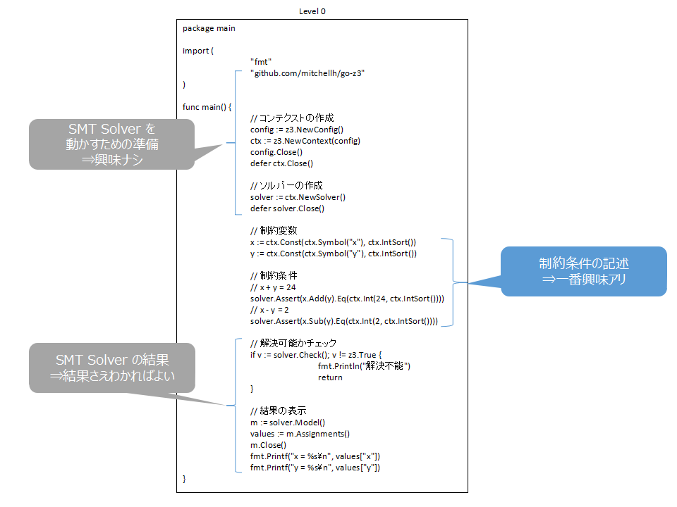

まずは、上のサンプルコードの少々雑多な部分をライブラリ化することで、どれだけ記述が簡単になるかみてみる。


----

## ステップ1. ライブラリ化

サンプルコード sample1.go を示す。

```
package main

func main() {
	// コンテクストとソルバーの作成
	c := NewContext()
	defer c.Close()

	// 制約変数
	x := c.IntVar("x")
	y := c.IntVar("y")

	// 制約条件
	// x + y = 24
	c.Assert(x.Add(y).Eq(c.IntVal(24)))
	// x - y = 2
	c.Assert(x.Sub(y).Eq(c.IntVal(2)))

	// 解決結果の表示
	c.Solve("x", "y")
}
```

前回のコードとの比較を示す。


実行例は次のようになる。

```
% go run sample1.go lib.go
x = 13
y = 11
```

処理の流れを示す。

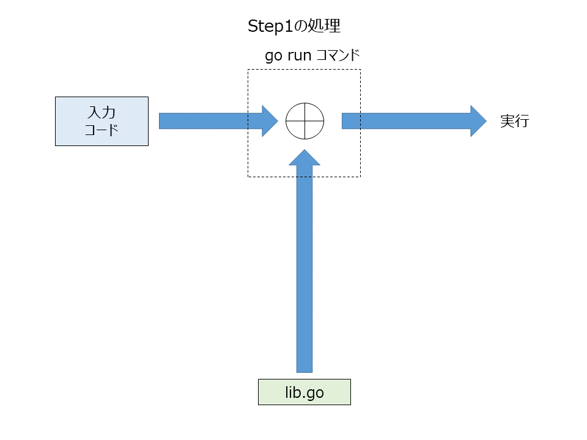


用意したライブラリ lib.go は下の通りである。

```golang
package main

import (
	"fmt"
	"github.com/mitchellh/go-z3"
)

// Context は z3 のコンテクストを保持するデータ型
type Context struct {
	ctx    *z3.Context
	solver *z3.Solver
}

// NewContext は新しいコンテクストを生成する関数
func NewContext() Context {
	// コンテクストの作成
	config := z3.NewConfig()
	ctx := z3.NewContext(config)
	config.Close()
	return Context{
		ctx:    ctx,
		solver: ctx.NewSolver(),
	}
}

// Close はコンテクストをクローズする関数
func (c Context) Close() {
	if c.solver != nil {
		c.solver.Close()
	}
	if c.ctx != nil {
		c.ctx.Close()
	}
}

// IntVar は整数型の制約変数のASTノードを作成する関数
func (c Context) IntVar(name string) *z3.AST {
	return c.ctx.Const(c.ctx.Symbol(name), c.ctx.IntSort())
}

// IntVal は整数値のASTノードを作成する関数
func (c Context) IntVal(value int) *z3.AST {
	return c.ctx.Int(value, c.ctx.IntSort())
}

// Assert は制約条件を宣言する関数
func (c Context) Assert(cond *z3.AST) {
	c.solver.Assert(cond)
}

// Solve は制約を解決する変数の値を表示する関数
func (c Context) Solve(names ...string) {
	// 解決可能かどうかを調べる
	if v := c.solver.Check(); v != z3.True {
		fmt.Println("unsolvable")
		return
	}

	// 制約を満たす値の取得
	m := c.solver.Model()
	values := m.Assignments()
	m.Close()

	// 可変引数で指定された変数名の値を表示
	for _, name := range names {
		fmt.Printf("%s = %s\n", name, values[name])
	}
}
```

z3 のコンテクストやソルバーをまとめ、変数定義など、サンプルコードの中で使用する関数をすべて束ね、そして go-z3 との依存性をすべてライブラリに寄せることにより、サンプルコードからの go-z3 のインポートを不要にする。

ライブラリ化によって記述量が減少した。
しかしそれでも golang 特有のパッケージ宣言や main 関数の宣言など、毎回同じ内容を記述するのは無駄が多い。なくしてしまいたい。

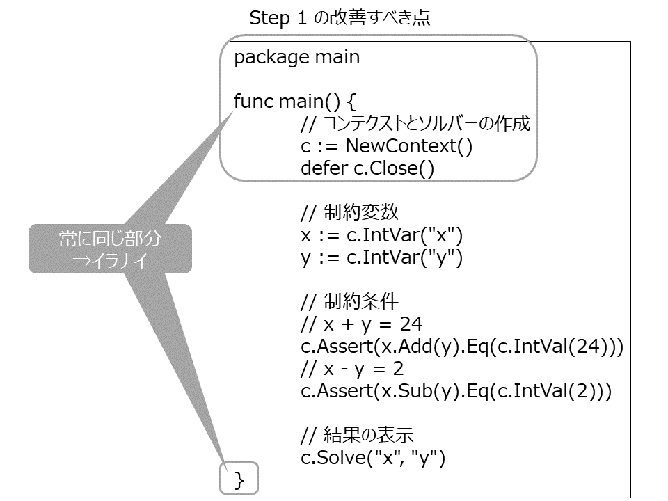

----

## ステップ2. 差分テキスト化

サンプルコード sample2.txt を示す。

```
// 制約変数
x := c.IntVar("x")
y := c.IntVar("y")

// 制約条件
// x + y = 24
c.Assert(x.Add(y).Eq(c.IntVal(24)))
// x - y = 2
c.Assert(x.Sub(y).Eq(c.IntVal(2)))

// 解決結果の表示
c.Solve("x", "y")
```

前回のコードとの変化内容を示す。

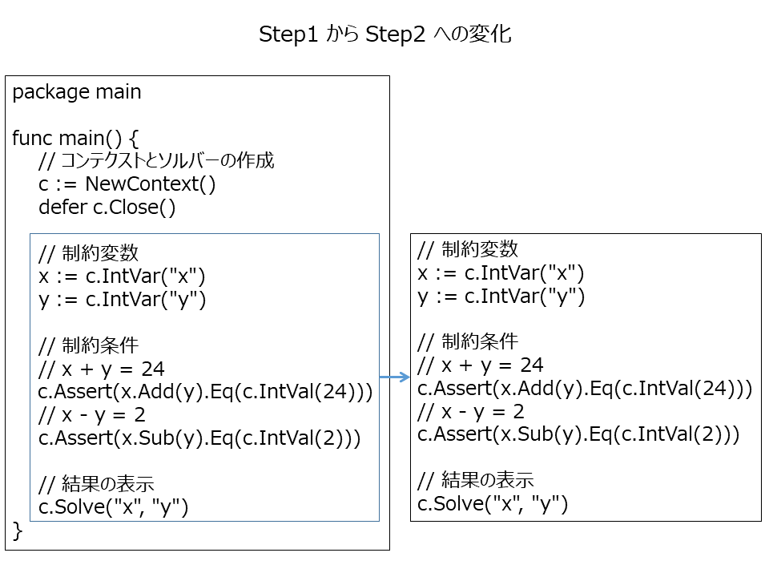

実行には次のように専用のシェルスクリプトを使う。

```
% run.sh sample2.txt
x = 13
y = 11
```

処理は次のようになっている。

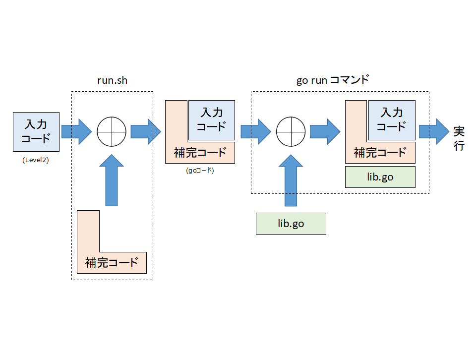

このシェルスクリプト run.sh の中で golang 特有のパッケージ宣言や main 関数の宣言を補完する。

```
#!/bin/sh

filename=`basename $1 .txt`$$.go

(
    echo "package main"
    echo "func main() {"
    echo "c := NewContext()"
    echo "defer c.Close()"
    cat $1
    echo "}"
) > $filename

go run $filename lib.go

rm $filename
```

見通しがよくなり、記述量が減少した。

しかし、差分テキスト化することにより、各関数のプレフィクスの "c." がもはや意味をなさなくなってしまった。
無駄なのでなくしてしまいたい。

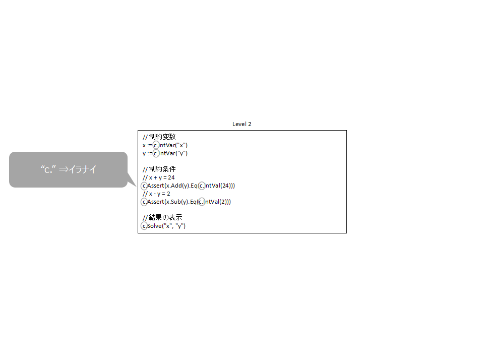

----

## ステップ3. ライブラリ化その２

サンプルコード sample3.txt を示す。

```
// 制約変数
x := IntVar("x")
y := IntVar("y")

// 制約条件
// x + y = 24
Assert(x.Add(y).Eq(IntVal(24)))
// x - y = 2
Assert(x.Sub(y).Eq(IntVal(2)))

// 解決結果の表示
Solve("x", "y")
```

前回のコードとの変化内容を示す。

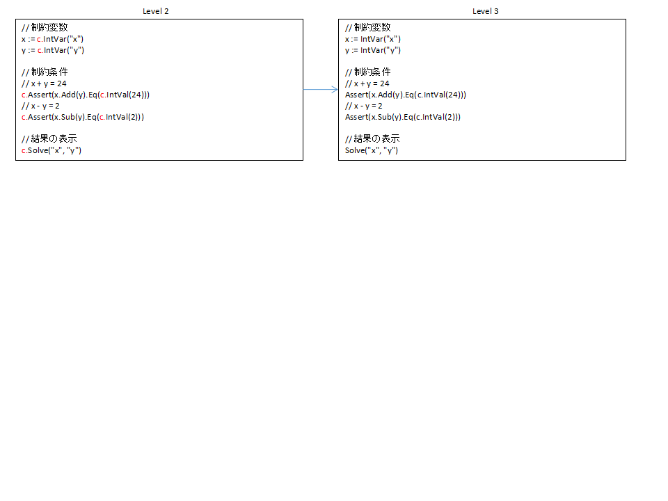

処理の流れは次の通り。

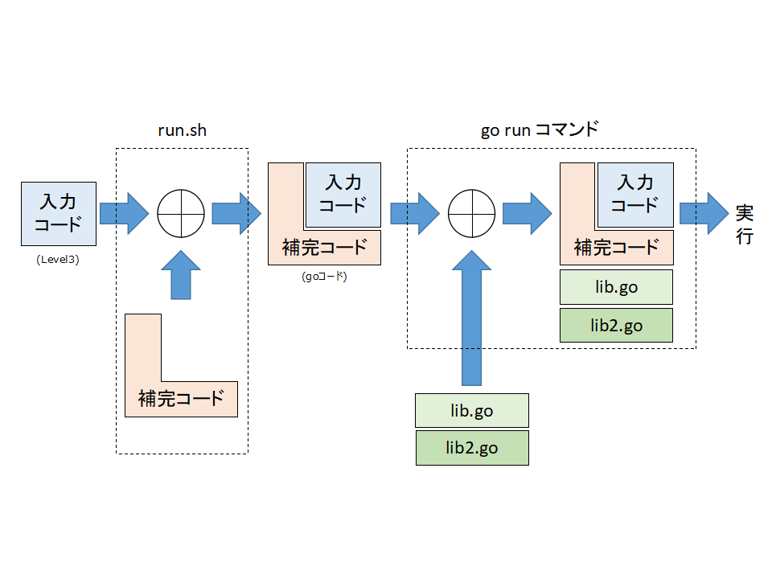

実行例は次のようになる。

```
% run.sh sample3.txt
```

実行用シェルスクリプト run.sh は次のようになる。

```
#!/bin/sh

filename=`basename $1 .txt`$$.go

(
    echo "package main"
    echo "func main() {"
    echo "ccc = NewContext()"
    echo "defer ccc.Close()"
    cat $1
    echo "}"
) > $filename

go run $filename lib.go lib2.go

rm $filename
```

ライブラリ lib2.go を追加し、コンテクストオブジェクトのグローバル化を行なった。

```
package main
import (
	"github.com/mitchellh/go-z3"
)

// グローバル変数
var ccc Context

// IntVar は整数型の制約変数を作成する関数
func IntVar(name string) *z3.AST {
	return ccc.IntVar(name)
}

// IntVal は整数値を作成する関数
func IntVal(value int) *z3.AST {
	return ccc.IntVal(value)
}

// Assert は制約条件を宣言する関数
func Assert(cond *z3.AST) {
	ccc.Assert(cond)
}

// Solve は制約を解決する変数の値を表示する関数
func Solve(names ...string) {
	ccc.Solve(names...)
}
```

なお、上の変数のグローバル化により追加ライブラリは「main パッケージ限定」となってしまい、github などへの外出しの道は絶たれてしまったことに注意。

コードの方はだいぶ見通しはよくなったし、記述量も低減された。

しかしそれでも、制約条件が直感的ではない。

利用者としては「数学的な条件式」を使いたい。

この他、制約変数で使っている文字列表記は冗長なので単純化したい。

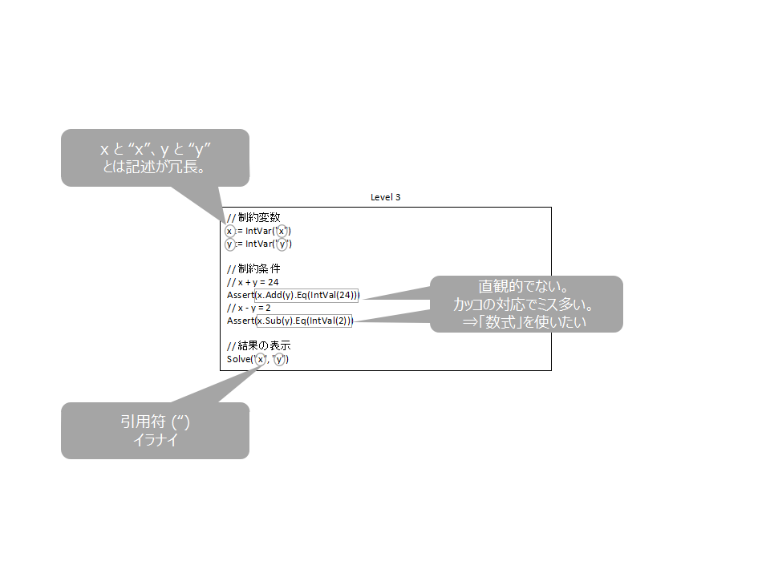

----

## ステップ4. 制約条件の数式化

サンプルコード sample4.txt を示す。

```golang
// 制約変数
var x, y Int

// 制約条件
Assert(x + y == 24)
Assert(x - y == 2)

// 解決結果の表示
Solve(x, y)
```

前回のコードとの変化内容を示す。

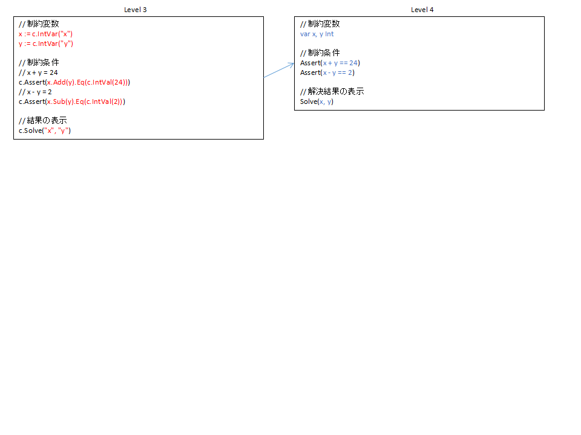

上のような変化は、ライブラリ化や差分テキスト化だけでは対応できないのであえて後回しにしてきた。

ここでは「黒魔術」を使うことになる。つまり、go/ast パッケージを使用し、AST を加工することで対処することになる。

AST とは Abstract Syntax Tree の略であり、日本語では「抽象構文木」と呼ばれる。
やや端折って簡単に言い切ってしまうと、ソースコードの構文に対応する木構造のことである。

今回は Assert 関数の引数の制約条件式の AST を取得し変換する。

処理の流れを示す。

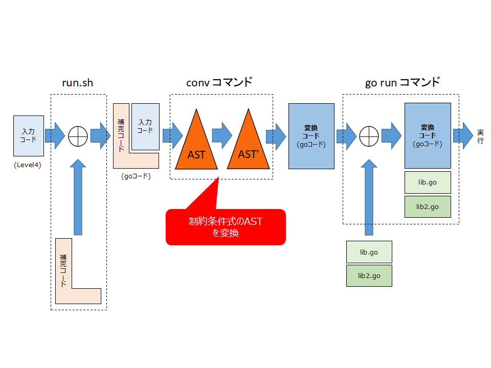

シェルスクリプト run.sh は次のようになる。

```
#!/bin/sh

filename=`basename $1 .txt`.go

./conv $1 $filename

go run $filename lib.go lib2.go

rm $filename
```

conv コマンドの中で行っている、制約条件式の変換の前後を木構造で示すと次のようになる。

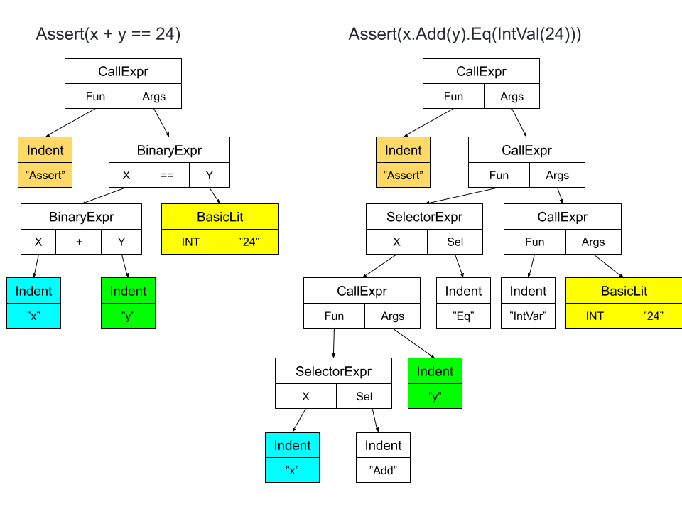

左の木を右の木に変換する。なお、図で同じ色の箇所は前後で対応する箇所である。

AST は go/parser パッケージにより取得する。


該当箇所を抜粋する。

パージング

```golang
// 差分ファイルの読み出し
src := readSrc(os.Args[1])

// 入力の前後に文字列を追加
src = `package main
func main() {
ccc = NewContext()
defer ccc.Close()` + src + "}"

// Golang のソースコードとしてパース
fileNode, err := parser.ParseFile(fset, "", src, 0)
```

AST の書き換え

```golang
// "main" 関数のステートメントリストの取得
stmts := pickupMainStmts(fileNode)

// 各ステートメントの処理
for i, stmt := range stmts {
	switch stmt.(type) {
	case *ast.DeclStmt: // 宣言のステートメント
		〜
	case *ast.ExprStmt: // 式のステートメント
		es := stmt.(*ast.ExprStmt)
		if isAssert(es.X) { // "Assert" 関数のとき
			ce := es.X.(*ast.CallExpr)
			// 第一引数を書き換え
			ce.Args[0] = convExpr(ce.Args[0])
```

式のASTの変換は再帰的に行なう。

```golang
// convExpr は Assert 関数の引数で指定された式のASTを変換する関数
func convExpr(expr ast.Expr) (r ast.Expr) {
	switch expr.(type) {
	case *ast.BinaryExpr:
		r = convBinaryExpr(expr.(*ast.BinaryExpr))
	case *ast.UnaryExpr:
		r = convUnaryExpr(expr.(*ast.UnaryExpr))
	case *ast.CallExpr:
		r = convCallExpr(expr.(*ast.CallExpr))
	case *ast.ParenExpr:
		r = convExpr(expr.(*ast.ParenExpr).X)
	case *ast.Ident:
		r = convIdent(expr.(*ast.Ident))
	case *ast.BasicLit:
		r = convBasicLit(expr.(*ast.BasicLit))
	default:
		// 上記以外は変換しない。
		r = expr
	}
	return
}

// convUnaryExpr は単行演算式を変換する関数
func convUnaryExpr(expr *ast.UnaryExpr) (r ast.Expr) {
	if expr.Op != token.NOT {
		r = expr
		return
	}
	r = &ast.CallExpr{
		Fun: &ast.SelectorExpr{
			X:   expr.X,
			Sel: ast.NewIdent("Not"),
		},
	}
	return
}
```

その他、次の変換も行っている。

|変換前|変換後|
|:-----|:----|
|var x, y Int|x, y := IntVar("x"), IntVar("y")|
|Solve(x, y)|Solve("x", "y")|

制約変数の変数宣言では通常の "int" の変数宣言と区別がつくよう、"Int" という型で表現する。

## 評価

各ステップでのサンプルコードの行数・バイト数、および、実装したライブラリ等の行数をそれぞれまとめる。

| | code [lines] | code [bytes] | libs [lines] |
|:--|:---:|:--:|:--:|
|STEP0|41|806|-|
|STEP1|19|335|80|
|STEP2|11|212|95|
|STEP3|11|198|133|
|STEP4|8|122|525|

ステップ4のサンプルコードの行数・バイト数はそれぞれステップ0の20%・15%に低減された。

他方で各ステップを経るほど実装したライブラリ等の行数は増えることがわかる。

特にステップ4では AST の変換処理が実装量の大勢を占める。
それでも、これらは一度実装してしまえ今回のサンプルコード以外でも再利用可能な部分であり、無駄な投資とはならない。


