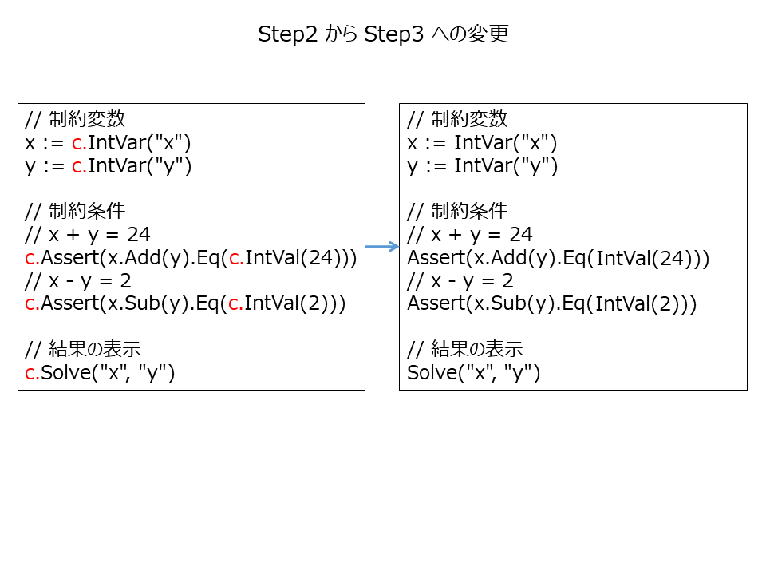

# Practice of DSL

ここでは、DSL のデザインをステップ・バイ・ステップで行っていくメモを記していく。

----

## はじめに

DSL とは Domain Specific Language の略であり日本語では「ドメイン固有言語」と言うらしい。

汎用的なプログラミング言語は DSL とは呼ばない。あくまで用途が限定されるような場合に DSL と呼ぶようだ。

ここでは、SMT Solver を使うための DSL を考える。

なお、以下では [Z3](https://github.com/Z3Prover/z3) の golang フロントエンドである [go-z3](https://github.com/mitchellh/go-z3) を使うが、Z3 や go-z3 のインストール手順などについてはそれぞれののサイトを参照いただきたい。

## 基本方針

SMT Solver 向けの DSL を考えるにあたって次の方針とする。

* 実装に使用するプログラミング言語は golang とする。
* 新しく作る DSL の構文仕様は golang の構文仕様と親和性のあるものとする。
* SMT Solver として "Z3" を使うが、フロントエンドは go-binding である "go-z3" を使う。
* "go-z3" 以外は、すべて標準パッケージのみを使って実装する。
* 新たにスクラッチからパーサを実装することはしない。

今回の DSL の利用者は以下を想定する。

* 論理学の知識があり SMT Solver の制約条件の検討ができる。
* 基本的な IT リテラシはあるものとし、OS などのプラットフォームの基本操作は一通りできる。
* プログラミングスキルはない。
* 手順書や業務手順書が与えられれば、未知のシステムでも手順通りに操作する勤勉さはある。

制約式の検討はできてもプログラミングスキルがないことを前提とする。
一方で、利用者のプログラミングを教育していくのもそれなりにコストが発生するのでそれも避けたい。

このような条件下で利用者が SMT Solver を使えるよう運用していくには、DSL が適切な抽象レベルでかつ適切なパワーを持つよう工夫することがキモとなる。

----

## ステップ0. 最初のサンプルコード

SMT Solver とは Satisfiable Modulo Theories Solver の略で、一階述語論理式で記述された制約条件を満たす値を解決してくれるシステムである。

例題として、次のような条件式を満たす整数 x と y の解決を考える。


この例を解決するサンプルコードを示す。

```golang
package main

import (
	"fmt"
	"github.com/mitchellh/go-z3"
)

func main() {
	// コンテクストの作成
	config := z3.NewConfig()
	ctx := z3.NewContext(config)
	config.Close()
	defer ctx.Close()

	// ソルバーの作成
	solver := ctx.NewSolver()
	defer solver.Close()

	// 制約変数の定義
	x := ctx.Const(ctx.Symbol("x"), ctx.IntSort())
	y := ctx.Const(ctx.Symbol("y"), ctx.IntSort())

	// 制約条件
	// x + y = 24
	solver.Assert(x.Add(y).Eq(ctx.Int(24, ctx.IntSort())))
	// x - y = 2
	solver.Assert(x.Sub(y).Eq(ctx.Int(2, ctx.IntSort())))

	// 解決可能化チェック
	if v := solver.Check(); v != z3.True {
		fmt.Println("解決不能")
		return
	}

	// 結果の表示
	m := solver.Model()
	values := m.Assignments()
	m.Close()
	fmt.Printf("x = %s\n", values["x"])
	fmt.Printf("y = %s\n", values["y"])
}
```

実行結果：

```
% go run sample.go 
x = 13
y = 11
```

実行すると制約条件を満たす整数 x と y の値が表示される。

実際はこの例題のように一次方程式を解くような単純なものだけでなく、もっと複雑な制約条件を扱うわけだが今回は省略する。

さて、利用者の立場で考えてみると、上のサンプルコードのうち SMT Solver に渡す制約条件の記述については興味はあるが、専門外のライブラリのインポート・コンテクストやソルバーの作成・制約変数の定義など、SMT Solver を動かすためのコードの記述は意味不明であり、煩わしいだけだ。


以降は上のサンプルコードをステップ0 として、ステップ・バイ・ステップで DSL 化を勧めていくことにする。

まずは、上の雑多になっているコードをライブラリ化し整理することで、どれだけ記述が簡単になるかをみてみる。


----

## ステップ1. ライブラリ化

ステップ1 のサンプルコード sample1.go を示す。

```
package main

func main() {
	// コンテクストとソルバーの作成
	c := NewContext()
	defer c.Close()

	// 制約変数
	x := c.IntVar("x")
	y := c.IntVar("y")

	// 制約条件
	// x + y = 24
	c.Assert(x.Add(y).Eq(c.IntVal(24)))
	// x - y = 2
	c.Assert(x.Sub(y).Eq(c.IntVal(2)))

	// 解決結果の表示
	c.Solve("x", "y")
}
```

前ステップのコードからの変更を示す。


次のように実行する。

```
% go run sample1.go lib.go
x = 13
y = 11
```

作成したライブラリ [lib.go](lib.go) のポイントは下の通りである。

* z3 のコンテクストやソルバーをメンバーとしてもつ構造体型 Context を導入する。
* Context 型のメソッドとして、変数定義などのサンプルコードで使用する関数を実装する。
* go-z3 への依存性をすべて lib.go に寄せることにより、サンプルコードからの go-z3 のインポートを不要にする。


ステップ1 はステップ0 よりも、ライブラリ化によって利用者が記述するコード量は減少した。
しかしそれでも golang 特有のパッケージ宣言や main 関数の宣言など、毎回同じ内容を記述するのは無駄が多い。
また、利用者の入力ミスなどのおそれもあるのでなくしてしまいたい。


----

## ステップ2. 差分テキスト化

ステップ2 のサンプルコード sample2.txt を示す。

```
// 制約変数
x := c.IntVar("x")
y := c.IntVar("y")

// 制約条件
// x + y = 24
c.Assert(x.Add(y).Eq(c.IntVal(24)))
// x - y = 2
c.Assert(x.Sub(y).Eq(c.IntVal(2)))

// 解決結果の表示
c.Solve("x", "y")
```

前ステップのコードからの変更を示す。


次のように実行する。

```
% run.sh sample2.txt
x = 13
y = 11
```

使用するシェルスクリプト run.sh 内の処理は次の通り。


run.sh の中で golang 特有のパッケージ宣言や main 関数の宣言を補完し、go run コマンドで実行する。

具体的な実装は次の通りである。

```
#!/bin/sh

filename=`basename $1 .txt`$$.go

(
    echo "package main"
    echo "func main() {"
    echo "c := NewContext()"
    echo "defer c.Close()"
    cat $1
    echo "}"
) > $filename

go run $filename lib.go

rm $filename
```

ステップ2 では差分テキスト化することによって golang 特有のパッケージ宣言や main 関数の宣言などがなくなり、利用者の記述量はさらに減少した。

しかし差分テキスト化の副作用として、各関数のプレフィクスの "c." がもはや意味をなさなくなってしまった。
無駄な上に、これもまた利用者が入力ミスをおかすおそれがあるのでなくしてしまいたい。


----

## ステップ3. ライブラリ化その２

ステップ3 のサンプルコード sample3.txt を示す。

```
// 制約変数
x := IntVar("x")
y := IntVar("y")

// 制約条件
// x + y = 24
Assert(x.Add(y).Eq(IntVal(24)))
// x - y = 2
Assert(x.Sub(y).Eq(IntVal(2)))

// 解決結果の表示
Solve("x", "y")
```

前ステップのコードからの変更を示す。



実行はステップ2 と同じである。

```
% run.sh sample3.txt
x = 13
y = 11
```

run.sh 內部の処理は次の通り。


ステップ2 との run.sh の差分は、ライブラリ [lib2.go](lib2.go) が増えたことである。
追加したライブラリにより、コンテクスト変数のグローバル化を行なった。

```
#!/bin/sh

filename=`basename $1 .txt`$$.go

(
    echo "package main"
    echo "func main() {"
    echo "ccc = NewContext()"
    echo "defer ccc.Close()"
    cat $1
    echo "}"
) > $filename

go run $filename lib.go lib2.go

rm $filename
```

無駄な "c." プレフィクスがなくなって、利用者の記述量はまた低減された。

しかしそれでも、制約条件が直感的ではないという問題が残っている。
式が複雑になってくると、またしても利用者が入力ミスをおかすおそれがある。
特に括弧を適切に対応させねばならないのは面倒かもしれない。

利用者としては「数学的な条件式」を使いたい。

この他、制約変数で使っている文字列表記は冗長なので単純化したい。


----

## ステップ4. 制約条件の数式化

ステップ4 のサンプルコード sample4.txt を示す。

```golang
// 制約変数
var x, y Int

// 制約条件
Assert(x + y == 24)
Assert(x - y == 2)

// 解決結果の表示
Solve(x, y)
```

前ステップのコードからの変更を示す。


上のような変更を行なうには Assert 関数の引数の式の構造を自動的に変換する必要があるが、
ライブラリ化や差分テキスト化だけでは対応できない。

今回は Assert 関数の引数の式の "AST" を加工することで対応した。

"AST" とは "Abstract Syntax Tree" の略であり、日本語では「抽象構文木」と呼ばれる。
やや端折って簡単に言い切ってしまうと、ソースコードの構文に対応する木構造のことである。

AST の例を以下に示す。


シェルスクリプト run.sh 內部の処理を示す。


```
#!/bin/sh

filename=`basename $1 .txt`.go

conv $1 $filename

go run $filename lib.go lib2.go

rm $filename
```

conv コマンドの中で変換している AST の前後を以下に示す。


(図中の同じ色の箇所は前後で対応する箇所)


以下、conv コマンドにおけるコードを抜粋して処理を解説する。

### 差分テキストの補完処理とパージング処理

差分テキストの補完処理は単に入力コードの前後に補完コードの文字列を連結するだけである。
パージング処理には go の標準パッケージである go/parser パッケージを利用する。
このようにしてパージング処理の結果、上の例では fileNode 変数に AST が格納される。

```golang
// 入力コードの読み出し
src := readSrc(os.Args[1])

// 差分テキストの補完処理。入力コードの前後に補完コードを連結
src = `package main
func main() {
ccc = NewContext()
defer ccc.Close()` + src + "}"

// Golang のソースコードとしてパースし、AST を取得
fileNode, err := parser.ParseFile(fset, "", src, 0)
```

### 変換箇所の特定

各ステートメントの中から Assert 関数のステートメントをみつけ、変換の対象となる式を特定する。

```golang
// 各ステートメントの処理
for i, stmt := range stmts {
	switch stmt.(type) {
	...
	case *ast.ExprStmt: // 式のステートメント
		es := stmt.(*ast.ExprStmt)
		if isAssert(es.X) { // "Assert" 関数のとき
			ce := es.X.(*ast.CallExpr)
			// 第一引数を書き換え
			ce.Args[0] = convExpr(ce.Args[0])
```

### 式のASTの変換

「式」には、二項演算式、単項演算式、関数呼び出し、など、複数のケースがあるため、
それぞれのケースに応じて switch 文で分岐しながら AST の木構造をトラバースしていく。
ただし変換の必要のない式もあることに注意。

```golang
// convExpr は Assert 関数の引数で指定された式のASTを変換する関数
func convExpr(expr ast.Expr) (r ast.Expr) {
	switch expr.(type) {
	case *ast.BinaryExpr:
		r = convBinaryExpr(expr.(*ast.BinaryExpr))	// 二項演算式の変換
	case *ast.UnaryExpr:
		r = convUnaryExpr(expr.(*ast.UnaryExpr))	// 単項演算式の変換
	case *ast.CallExpr:
		r = convCallExpr(expr.(*ast.CallExpr))		// 関数呼び出し式の変換
	case *ast.ParenExpr:
		r = convExpr(expr.(*ast.ParenExpr).X)		// 括弧で囲まれた式の変換
	case *ast.Ident:
		r = convIdent(expr.(*ast.Ident))		// 識別子からなる式の変換
	case *ast.BasicLit:
		r = convBasicLit(expr.(*ast.BasicLit))		// 整数などのリテラルからなる式の変換
	default:
		// 上記以外は変換しない。
		r = expr
	}
	return
}
```

以下は単項演算式（Not）の例である。
入力の AST ノードに対して、対応する AST ノードを生成しリターンすることで変換している。
ここでも Not の対象となる式を再帰的に変換している。

```golang
// convUnaryExpr は単行演算式を変換する関数
func convUnaryExpr(expr *ast.UnaryExpr) (r ast.Expr) {
	if expr.Op != token.NOT {
		r = expr
		return
	}
	r = &ast.CallExpr{	// 対応する AST ノードの生成
		Fun: &ast.SelectorExpr{
			X:   convExpr(expr.X), // NOT演算子の引数の変換（再帰的な変換）
			Sel: ast.NewIdent("Not"),
		},
	}
	return
}
```


上の Assert 関数の引数の変換の他に、次の変数宣言と Solve 関数の引数の変換も行なう。

### 変数宣言の変換

制約変数の変数宣言では通常の "int" の変数宣言と区別がつくよう、"Int" という型で表現する。
制約変数の宣言は IntVar 関数を用いた表現に変換することでコンパイルできるようにする。

```
// 変換前
var x, y Int
// 変換後
x, y := IntVar("x"), IntVar("y")
```

変換前後の AST を示す。


### Solve関数の引数の変換

表示する制約変数の指定時に引用符をつけなくてもよいようにしたので、Solve 関数の引数に並ぶ変数名を文字列に変換する。

```
// 変換前
Solve(x, y)
// 変換後
Solve("x", "y")|
```

変換前後の AST を示す。


## おわりに

* 今回は SMT Solver 用の DSL のデザインをステップ・バイ・ステップで行なった。
* 最後の STEP4 のサンプルコードの行数・バイト数を STEP0 と比べると、それぞれ 20%・15% まで低減された。
* 制約条件式も数式表現が使えるので入力ミスをある程度は防ぐことができる。
* 今回のアプローチではパーサの実装は不要となったのはよかったが、式のパターンが多いため AST の変換処理はやや面倒なものとなった。
* 実際のコーディング作業にはそれでも 3 時間くらい要した。
* DSL そのものについて利用者から現時点で不満は出ていない。

今後について

* 今回使用した go-z3 の能力不足な面が明らかになってきた。
 - 配列を扱えない、
 - Z3 の API をすべて実装していない、など
* 別の SMT Solver のパッケージへの移行を検討中

----

## サンプル

今回デザインした DSL のサンプルを示す。

### 虫食い計算

google の入社試験を解いてみる。

```
// mushikui.txt

//   WWWDOT
// - GOOGLE
// --------
//   DOTCOM

// 各アルファベットは整数
var W, D, O, T, G, L, E, C, M Int

// 各アルファベットは一意な数字
Assert(Distinct(W, D, O, T, G, L, E, C, M))

// 各アルファベットは一桁の整数（0以上10未満）
// かつ、先頭の W, G, D は 0 以外
Assert(W>=1 && W<10)
Assert(D>=1 && D<10)
Assert(O>=0 && O<10)
Assert(T>=0 && T<10)
Assert(G>=1 && G<10)
Assert(L>=0 && L<10)
Assert(E>=0 && E<10)
Assert(C>=0 && C<10)
Assert(M>=0 && M<10)

// ボロウ b1～b5 は筆算で上の位から借りてくる値
//   W  W  W  D  O  T
//   b5 b4 b3 b2 b1
// - G  O  O  G  L  E
// --------------
//   D  O  T  C  O  M

var b1, b2, b3, b4, b5 Int

// ボロウは 0 または 1
Assert(b1 == 0 || b1 == 1)
Assert(b2 == 0 || b2 == 1)
Assert(b3 == 0 || b3 == 1)
Assert(b4 == 0 || b4 == 1)
Assert(b5 == 0 || b5 == 1)

// 筆算（各桁ごとの関係）
Assert(T + b1*10 -E     == M)
Assert(O + b2*10 -L -b1 == O)
Assert(D + b3*10 -G -b2 == C)
Assert(W + b4*10 -O -b3 == T)
Assert(W + b5*10 -O -b4 == O)
Assert(W         -G -b5 == D)

Solve(W, D, O, T, G, L, E, C, M)
```

実行結果。

```
C:\work>sh run.sh mushikui.txt
W = 7.
D = 5.
O = 8.
T = 9.
G = 1.
L = 0.
E = 3.
C = 4.
M = 6.
```

----

# 付録: [配列対応](array/README.md)
