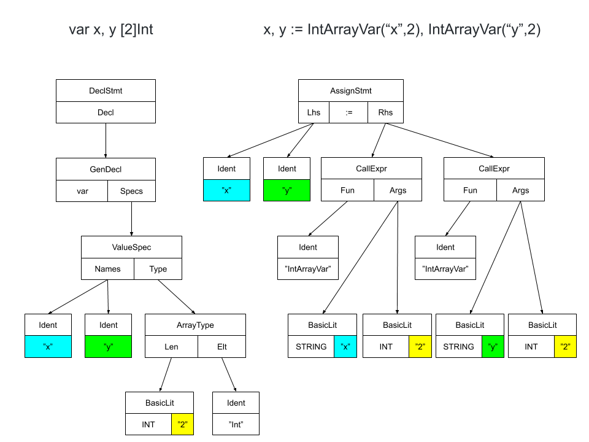
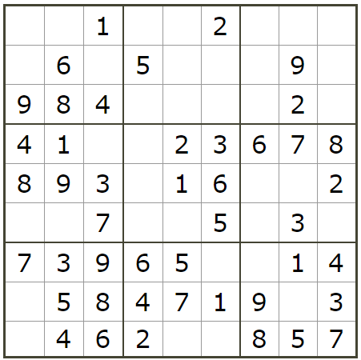
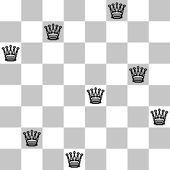

# 配列への対応

DSL の表現力を強化するため、配列への対応を行う。

制約変数を配列で宣言できるように AST を変換する。

```
変換前：
var xs, ys [2]Int

変更後：
xs, ys := IntArrayVar("xs", 2), IntArrayVar("ys", 2)
```

変換前後の AST は下の通りです。



IntArrayVar は与えられた変数名・要素数の変数を宣言する関数である。

```golang
func IntArrayVar(name string, num int) (r []*z3.AST) {
	for i := 0; i < num; i++ {
		r = append(r, IntVar(fmt.Sprintf("%s[%d]", name, i)))
	}
	return
}
```

したがって、等価コードは次のようになる。

```
xs, ys := []*z3.AST{IntVar("xs[0]"),IntVar("xs[1]")}, []*z3.AST{IntVar("ys[0]"),IntVar("ys[1]")}
```

## サンプル

以下、配列を用いたサンプルを示す。

### 数独



```
// 9x9 の数独
//
// 0 : 虫食い部分
//
// 0, 0, 1 | 0, 0, 2 | 0, 0, 0
// 0, 6, 0 | 5, 0, 0 | 0, 9, 0
// 9, 8, 4 | 0, 0, 0 | 0, 2, 0
// --------+---------+--------
// 4, 1, 0 | 0, 2, 3 | 6, 7, 8
// 8, 9, 3 | 0, 1, 6 | 0, 0, 2
// 0, 0, 7 | 0, 0, 5 | 0, 3, 0
// --------+---------+--------
// 7, 3, 9 | 6, 5, 0 | 0, 1, 4
// 0, 5, 8 | 4, 7, 1 | 9, 0, 3
// 0, 4, 6 | 2, 0, 0 | 8, 5, 7

// セル (１次元配列のみ使用可能)
var x [81]Int

// 制約条件1
// 各セルは 1～9 の整数
for i:=0; i<81; i++ {
    Assert(x[i]>=1 && x[i]<10)
}

// 制約条件2
// 同じ行の各セルは一意
for i:=0; i<9; i++ { // 縦
    Assert(Distinct(x[i*9],x[i*9+1],x[i*9+2],x[i*9+3],x[i*9+4],x[i*9+5],x[i*9+6],x[i*9+7],x[i*9+8]))
}

// 制約条件3
// 同じ列の各セルは一意
for j:=0; j<9; j++ { // 横
    Assert(Distinct(
        x[j],
        x[j+9],
        x[j+18],
        x[j+27],
        x[j+36],
        x[j+45],
        x[j+54],
        x[j+63],
        x[j+72]))
}

// 制約条件4
// 同じブロックの各セルは一意
for i:=0; i<9; i+=3 {     // 縦
    for j:=0; j<9; j+=3 { // 横
        Assert(Distinct(
            x[i*9+j],     x[i*9+j+1],     x[i*9+j+2],
            x[(i+1)*9+j], x[(i+1)*9+j+1], x[(i+1)*9+j+2],
            x[(i+2)*9+j], x[(i+2)*9+j+1], x[(i+2)*9+j+2]))
    }
}

// 制約条件5
// 既知のセル
knownCells := []int {
    0, 0, 1, 0, 0, 2, 0, 0, 0,
    0, 6, 0, 5, 0, 0, 0, 9, 0,
    9, 8, 4, 0, 0, 0, 0, 2, 0,
    4, 1, 0, 0, 2, 3, 6, 7, 8,
    8, 9, 3, 0, 1, 6, 0, 0, 2,
    0, 0, 7, 0, 0, 5, 0, 3, 0,
    7, 3, 9, 6, 5, 0, 0, 1, 4,
    0, 5, 8, 4, 7, 1, 9, 0, 3,
    0, 4, 6, 2, 0, 0, 8, 5, 7,
}

for idx, n := range knownCells {
    if n>0 {
        // Assert(x[idx] == n) と書きたいところだがＮＧ。
        // Assert 内の変数は変換されないので IntVal(n) しておく。
        knownValue := IntVal(n)
        Assert(x[idx] == knownValue)
    }
}

Solve(x)

// ===========================
//
// 解答
//
// 5, 7, 1 | 3, 9, 2 | 4, 8, 6
// 3, 6, 2 | 5, 8, 4 | 7, 9, 1
// 9, 8, 4 | 1, 6, 7 | 3, 2, 5
// --------+---------+--------
// 4, 1, 5 | 9, 2, 3 | 6, 7, 8
// 8, 9, 3 | 7, 1, 6 | 5, 4, 2
// 6, 2, 7 | 8, 4, 5 | 1, 3, 9
// --------+---------+--------
// 7, 3, 9 | 6, 5, 8 | 2, 1, 4
// 2, 5, 8 | 4, 7, 1 | 9, 6, 3
// 1, 4, 6 | 2, 3, 9 | 8, 5, 7
```

実行結果。

```
C:\work>sh run.sh sudoku.txt
x[0] = 5
x[1] = 7
x[2] = 1
x[3] = 3
x[4] = 9
x[5] = 2
x[6] = 4
x[7] = 8
x[8] = 6
x[9] = 3
x[10] = 6
x[11] = 2
x[12] = 5
x[13] = 8
x[14] = 4
x[15] = 7
x[16] = 9
x[17] = 1
x[18] = 9
x[19] = 8
x[20] = 4
x[21] = 1
x[22] = 6
x[23] = 7
x[24] = 3
x[25] = 2
x[26] = 5
x[27] = 4
x[28] = 1
x[29] = 5
x[30] = 9
x[31] = 2
x[32] = 3
x[33] = 6
x[34] = 7
x[35] = 8
x[36] = 8
x[37] = 9
x[38] = 3
x[39] = 7
x[40] = 1
x[41] = 6
x[42] = 5
x[43] = 4
x[44] = 2
x[45] = 6
x[46] = 2
x[47] = 7
x[48] = 8
x[49] = 4
x[50] = 5
x[51] = 1
x[52] = 3
x[53] = 9
x[54] = 7
x[55] = 3
x[56] = 9
x[57] = 6
x[58] = 5
x[59] = 8
x[60] = 2
x[61] = 1
x[62] = 4
x[63] = 2
x[64] = 5
x[65] = 8
x[66] = 4
x[67] = 7
x[68] = 1
x[69] = 9
x[70] = 6
x[71] = 3
x[72] = 1
x[73] = 4
x[74] = 6
x[75] = 2
x[76] = 3
x[77] = 9
x[78] = 8
x[79] = 5
x[80] = 7
```


### Eight Queen



```
// 8queen.txt
// Eight Queen

// 以下ではクイーンを配置するセルの座標を (x,y) と表現する。
// 盤面の左上のセルの座標は (0,0) とする。

// pos はクイーンを配置する位置を格納する配列。
// クイーンのy座標に対応するx座標を格納する。
//    pos[y]=x
// こうすることで、同じ y座標には必ず一つのクイーンの座標のみとなることが保障されることに注意。

var pos [8]Int

// 制約１：pos に格納する値は互いに一意な整数
Assert(Distinct(pos[0],pos[1],pos[2],pos[3],pos[4],pos[5],pos[6],pos[7]))

// 制約２：pos に格納する値は 0以上8未満の整数であること。
for i:=0; i<8; i++ {
    Assert(pos[i]>=0 && pos[i]<8)
}

// 制約３：右上がりの位置にクイーンを配置してはならない。
//    右上がりに二つのクイーンを配置した場合は x+y が同じ値となる。
//    クイーン１の位置を (x1,y1)、クイーン２の位置を (x2,y2) とすると、
//    x1+y1 != x2+y2
//    pos を使うと、
//    pos[y1]+y1 != pos[y2]+y2
//    変形して、
//    pos[y1]-pos[y2] != y2-y1
//
// 制約４：右下がりの位置にクイーンを配置してはならない。
//    右下がりに二つのクイーンを配置した場合は x-y が同じ値となる。
//    クイーン１の位置を (x1,y1)、クイーン２の位置を (x2,y2) とすると、
//    x1-y1 != x2-y2
//    pos を使うと、
//    pos[y1]-y1 != pos[y2]-y2
//    変形して、
//    pos[y2]-pos[y1] != y2-y1

for i:=0; i<8; i++ {     // クイーン１のy座標
    for j:=0; j<8; j++ { // クイーン２のy座標
        if i!=j {
            n := IntVal(j-i)
            Assert(pos[i]-pos[j] != n && pos[j]-pos[i] != n)
        }
    }
}

Solve(pos)

/*
    解答例
    0, 0, 0, Q, 0, 0, 0, 0
    0, Q, 0, 0, 0, 0, 0, 0
    0, 0, 0, 0, 0, 0, 0, Q
    0, 0, 0, 0, 0, Q, 0, 0
    Q, 0, 0, 0, 0, 0, 0, 0
    0, 0, Q, 0, 0, 0, 0, 0
    0, 0, 0, 0, Q, 0, 0, 0
    0, 0, 0, 0, 0, 0, Q, 0
*/
```

実行例

```
C:\work\>sh run.sh 8queen.txt
pos[0] = 3
pos[1] = 1
pos[2] = 7
pos[3] = 5
pos[4] = 0
pos[5] = 2
pos[6] = 4
pos[7] = 6
```
